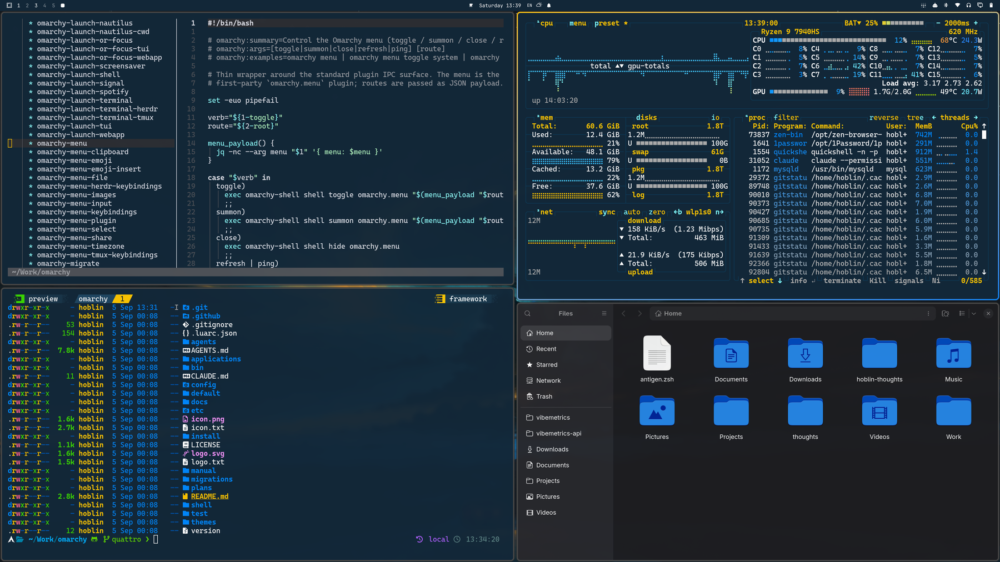

# Cobalt2 Theme for Omarchy

This is the **Cobalt2** Theme for [Omarchy.org](https://omarchy.org), providing a vibrant, developer-focused configuration set for your Linux desktop environment.



> Deep blue depths where code comes alive,  
> Golden highlights make syntax thrive.  
> In shadows of cobalt, thoughts take flight—  
> Where darkness meets brilliance, day turns to night.  
> The coder's canvas, both bold and true,  
> Where yellow sparks dance in oceans of blue.

## Compatibility

Version 2 targets **Omarchy 4 (Quattro)** and newer. It relies on the `colors.toml` palette and the template-generated theme files that arrived with Omarchy 4, and it no longer ships configs for the 3.x components (hyprlock, hypridle, mako, waybar, walker, swayosd).

On Omarchy 3.x, use the `v1` tag instead:

```bash
git clone --branch v1 https://github.com/hoblin/omarchy-cobalt2-theme ~/.config/omarchy/themes/cobalt2
```

## Installation

```bash
omarchy theme install https://github.com/hoblin/omarchy-cobalt2-theme
```

Or from the Omarchy menu (`Super + Space`): _Install > Style > Theme_, then paste the repository URL.

Once installed, pick "Cobalt2" under _Style > Theme_ and everything refreshes automatically.

## What's Included

- **Palette** (`colors.toml`) — the single source every generated file is rendered from: terminals, Hyprland, the Omarchy shell (bar, menus, notifications, lock, polkit), btop, helix, Chromium, Neovim, VS Code, Obsidian, and more.
- **Active-window gradient** — the signature yellow-to-blue border on the focused window. The same gradient flows into the shell's notification, popup, menu, lock and polkit borders.
- **btop** (`btop.theme`) — hand-tuned Cobalt2 gradients for the system monitor.
- **Obsidian** (`obsidian.css`) — note-taking app styling.
- **Chromium** (`chromium.theme`) — deep blue browser frame.
- **Icons** (`icons.theme`) — Yaru-blue icon set. Its folder blue sits on the palette's `#0088ff`; Yaru-yellow's amber never matched the theme's yellow.
- **Boot screen** (`unlock.png`) — Plymouth unlock art: cobalt's periodic-table tile, element 27, reading Co₂. Applied from _Style > Unlock_.
- **Backgrounds** — curated wallpapers that complement the Cobalt2 aesthetic.

The repository also carries hand-written **Alacritty**, **Ghostty**, **Kitty**, **Neovim** and **VS Code** files. They keep the golden cursor, and for Neovim and VS Code they select the real Cobalt2 colorschemes ([cobalt2.nvim](https://github.com/lalitmee/cobalt2.nvim) and [Wes Bos's extension](https://github.com/wesbos/cobalt2-vscode)).

Omarchy only applies those five from a theme it trusts. A theme cloned with `omarchy theme install` is not, so there they are regenerated from the palette instead, and Omarchy names the dropped files when the theme is set. To use them, clone the repository yourself and symlink it into place:

```bash
git clone https://github.com/hoblin/omarchy-cobalt2-theme ~/Work/omarchy-cobalt2-theme
ln -s ~/Work/omarchy-cobalt2-theme ~/.config/omarchy/themes/cobalt2
```

## Theme Colors

The Cobalt2 theme is built around these signature colors:

- **Background**: `#122738` (Deep Blue)
- **Lighter Background**: `#193549` (Cobalt Blue)
- **Accent**: `#ffc600` (Bright Yellow/Gold)
- **Selection**: `#0050a4` (Cobalt)
- **Text**: `#ffffff` (Pure White)
- **Syntax Highlights**: Various blues, cyans, oranges, and pinks for rich code highlighting

## Credits

This theme is inspired by the iconic [Cobalt2 theme](https://github.com/wesbos/cobalt2-vscode) originally created by Wes Bos for VSCode. The Neovim integration uses the [cobalt2.nvim](https://github.com/lalitmee/cobalt2.nvim) plugin. Background wallpapers are sourced from the curated collection at [dharmx/walls](https://github.com/dharmx/walls).

Created with ❤️ by hoblin for the Omarchy community.

## License

This theme is open-source and available under the MIT License.
